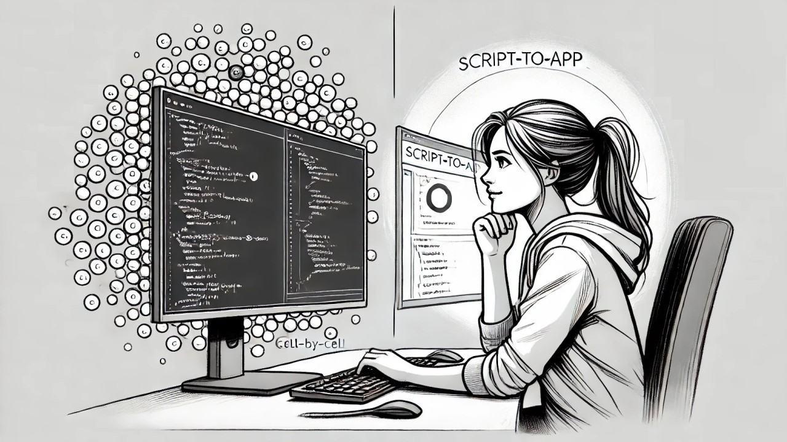

# Breaking Up with Jupyter Notebooks: How AI-Powered Apps Revitalized My Workflow

So, Jupyter Notebooks. We had some good times, didn't we?

Writing code and seeing the results instantly felt great. But over time, the quirks I once found charming became... less so. Navigating between cells to find code? Frustrating. Forget to run a cell, and dependencies laugh in your face. And the workflow... Each function, each step in an experiment, means executing cells manually, at a time. It felt like trying to bake a cake but having to preheat the oven separately for every ingredient.

<!-- more -->

Functions, logic, and outputs all mix together in one place, making complex workflows hard to manage. Admittedly, could be, I am just not good enough at using them.

Then once I told my coding AI assistant: "Could you develop a tool to present my results in a more interactive way?" And in her usual friendly manner, she replied: "Certainly...".

---

> That's how I discovered: AI-assisted app development.

---

## The Transformation

Now, I outline what I need, and AI helps me create a functional app using just natural language. In minutes, I have an interface to run and check my workflows. It's like having a sous-chef who preps all the ingredients while I sit back and sip coffee. (I really do!)

### Example: Document Processing Pipeline

Here's an illustrative example using Hugging Face's dataset: `mychen76/invoices-and-receipts_ocr_v1`

The UI allows me to:

- Configure my processing pipeline
- Select one or several documents to be processed
- View results displayed in a table

Everything I need is in one place: data sources, pipeline logic, and output displays. Refreshing code is just one click away. Searching through test results, sorting, filtering, visualizing—the imagination is the only limit.

## Why This Changed Everything

My data is presented dynamically. No more raw JSON dumps. Now, I have visuals that make insights accessible. It's interactive, engaging, and - dare I say - **fun**.

I've always been a backend developer, never really cared about frontend. Making this shift has been like "oh, I can do that? Am I in the developer's paradise?"

### What I Like: Time Savings

Time savings with every phase: setup, development, and testing. I spend less time and attention fiddling with the environment and have more resources to dive into the analysis. It's like having extra hours magically added to my day. No more disconnected cells or scattered logic.

### Beyond Notebooks

The app is then my go-to environment for presenting and evaluating results. Built-in graphical representations and tables allow for comfortable comparison between different experiment outcomes, and all the tedious evaluation work feels less like "Let's slog through this" and more like "Let's see what we find here".

---

## More Than a Replacement

It's actually more than a Notebook replacement. For me, as a developer, this script-to-app workflow has revolutionized my data projects. And it's not just about me. My clients now enjoy enhanced interaction with their data, exploring and making informed decisions. It's empowering, and it's exciting.

---

*Originally published on [LinkedIn](https://www.linkedin.com/pulse/breaking-up-jupyter-notebooks-how-ai-powered-apps-my-halyna-galanzina-ndbvc/)*

