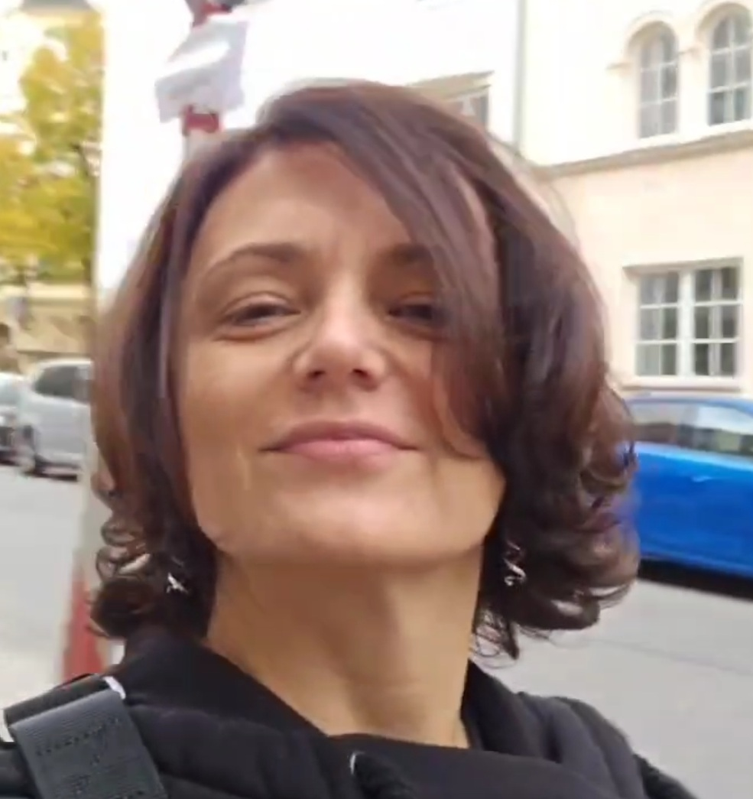

# Building AI Systems that survive Production

<!-- ### I build document AI systems that survive production — or diagnose why existing systems fail. -->

- Are you struggling to keep up with the rapid pace of AI innovation?

- Do you need help translating AI hype into real business results?

- Want to implement AI effectively before competitors get ahead?

- Looking for technical expertise and a clear roadmap for AI solutions?

- Need someone who understands both technical and business perspectives?

[Book Free Intro Call :material-arrow-top-right:](https://calendly.com/halyna-litai-solutions/discovery){target="_blank" .md-button .md-button--primary }

{ .profile-image alt="Portrait of Halyna Galanzina, Founder and AI solution developer" }

## About me

Hi! I'm Halyna, founder of LitAI LLC. I have 17 years in enterprise search and information extraction. I work with investment firms, legal ops, and enterprise platforms who need AI systems that work on real documents: complex tables, scanned PDFs, entity-heavy contracts, inconsistent structure. 

## My approach

Build evaluation into systems from day one. Not after. This creates clarity about where you can trust the system and where you can't — before you commit to scaling.

When things are already breaking in production, I diagnose root causes based on evidence and design fixes that stick.

## Recent work

**Investment Data Extraction (VC Fund)**: Automated a core pipeline that was previously a 100% manual process—a severe bottleneck that made scaling impossible. Because the existing standard was expert manual review, the quality benchmarks were exceptionally high. I designed the architecture to hit 90% accuracy across 30+ complex parameters, identifying and resolving inconsistencies in the legacy data along the way.

**RAG Evaluation Infrastructure**: Built a systematic measurement layer for an enterprise search assistant. Replaced noisy metrics with a calibrated LLM-as-a-judge framework and rigorous CI/CD regression testing using cost-efficient OSS models as judges.

**Medical Document Intelligence**: Developing a production-grade extraction and evaluation system for clinical lab results and doctor reports.

## Technical foundation

Information Extraction | RAG Evaluation | Document Intelligence | Hybrid Search | Python/FastAPI | Elasticsearch/Lucene

## Why work with me?

Here's what sets me apart and how I can help drive value for your business:

-   :fontawesome-solid-building-user:{ .lg .middle } Proven Technical Experience

    ---

    17 years in information extraction delivering AI-powered solutions across finance, R&D, HR, and legal.

-   :material-youtube:{ .lg .middle } LLM and GenAI specialization

    ---

    3 years specializing in LLMs & Generative AI applying the latest breakthroughs to real-world business needs.​

-   :material-school:{ .lg .middle } Trusted Partner

    ---

    100% retention rate – my clients stick with me because I deliver AI solutions that work.

-   :material-rocket:{ .lg .middle } Adjusting to your size and needs

    ---

    Delivering result to AI-driven startups & established companies ​optimizing workflows with LLMs.

<!-- ## What my past clients say about my work

-   :material-format-quote-open:{ .lg .middle } Adrian Dragomir
    
    Founder at Sferal

    ---

    "Dave is a true professional and my collaboration with him has been flawless. **He took his time and spent 3 days with me and my team in Mamaia, Romania where he was a guest for 3 sessions of my podcast Waves of AI**. He is one of the most competent people I know that has a real understanding of how AI works and how to integrate it quickly in your company."

-   :material-format-quote-open:{ .lg .middle } Barbara van den Bosch
    
    Founder at Viverve

    ---

    "Together with Datalumina, we developed a tailor-made program where I, as a school leader, can now bring together vast amounts of information in one place and automate key tasks. **Beyond the tremendous quality improvement for our organization, working with Datalumina was an extremely pleasant experience**."

-   :material-format-quote-open:{ .lg .middle } Rene Raaphorst
    
    Founder at Crypto Insiders

    ---

    "My experience with Datalumina has been excellent. **They think along with you every step of the way, from proof of concept to a fully functional product**. I was amazed by the quality of the results and found the collaboration very enjoyable. I highly recommend Dave and Datalumina to everyone!"

-   :material-format-quote-open:{ .lg .middle } Kelsen
    
    Founder at Datavisum

    ---

    "I am thankful for having come across Dave and Data Freelancer, it was one of the best investment decisions I've made in 2024. **From effective ways to create inbound marketing strategies using social media, through solution architecture design to address all kinds of business challenges**, you will extract a great deal of value from diverse perspectives."

 -->

<!-- ## Frequently asked questions

??? note "How quickly can you start working on my project?"
    I can typically begin new projects within 1-2 weeks of contract signing. For urgent matters, I maintain some flexibility for rapid response situations and can potentially start sooner - just let me know your timeline during our initial consultation.

??? note "Do you require a minimum project size or commitment?"
    While I can accommodate projects of any size, I find that engagements of at least 20 hours allow for meaningful impact. This gives us enough time to understand your data, implement solutions, and deliver actionable results. We can start with a small pilot project to ensure we're a good fit.

??? note "What industries do you have experience in?"
    I've successfully delivered projects across e-commerce, manufacturing, healthcare, and financial services. While I specialize in data science fundamentals that apply across sectors, I particularly excel in projects involving customer behavior analysis, process optimization, and predictive modeling.

??? note "How do you handle data security and confidentiality?"
    I take data security extremely seriously. I sign comprehensive NDAs before starting any project, use enterprise-grade encryption for all data transfers, and follow industry best practices for data handling. I can also work within your existing security infrastructure and policies.

??? note "What's your pricing structure?"
    I offer both project-based and retainer pricing models. Project fees are based on scope, complexity, and value delivered rather than hours worked. For ongoing support, I offer flexible retainer packages. Let's discuss your specific needs during our consultation to determine the most cost-effective approach.

??? note "How do you communicate progress and results?"
    I maintain clear communication through weekly progress updates and regular check-in meetings. You'll receive detailed documentation of all analyses, findings, and recommendations. For ongoing projects, I provide interactive dashboards and reports that allow you to track progress and results in real-time. -->

-   :material-coffee:{ .lg .middle } Let's have a virtual coffee together!

    ---
    
    Want to see if we're a match? Let's have a chat and find out. Schedule a free 30-minute strategy session to discuss your AI challenges and explore how we can work together.

    [Book Free Intro Call :material-arrow-top-right:](https://calendly.com){target="_blank" .md-button .md-button--primary }

