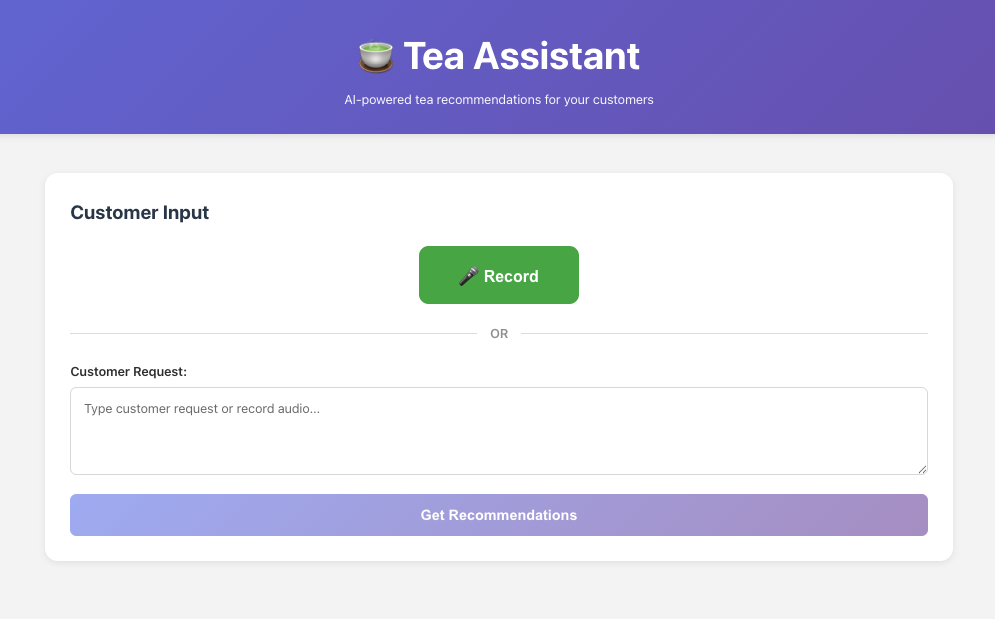
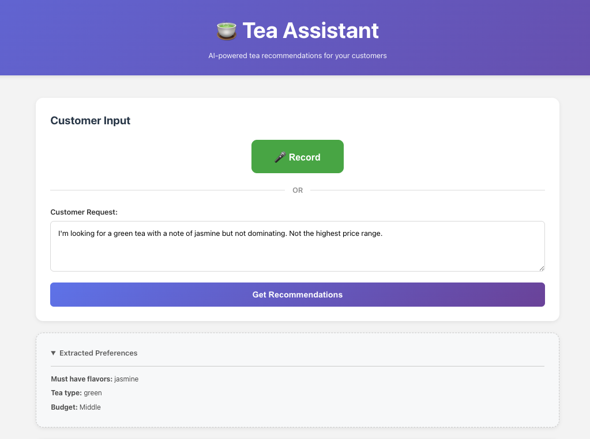
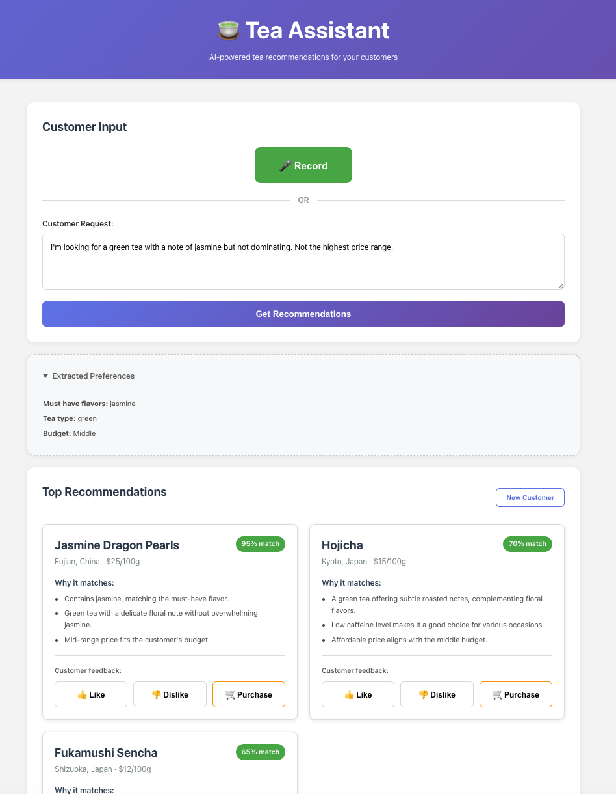

# AI Shop Assistant: From Raw Data to High-Performance AI

!!! abstract "Project Summary"
    **Type**: Concept Demo / Prototype
    **Build Time**: 2 hours
    **Purpose**: Demonstrate what AI-powered product recommendations look like, prototype

    **Key Features**:

    - Natural language input (voice or text) for product search
    - Structured intent extraction mapped to product taxonomy
    - Explainable recommendations with reasoning
    - Feedback capture loop for continuous improvement

## What This Is

A functional prototype built in 2 hours to demonstrate what an AI-powered shop assistant could look like for businesses with customer data and product catalogs.

This isn't a finished product. It's a **windshield** — a way to visualize the potential before committing to building the engine.

## Who This Is For

Businesses who have:

- Customer interaction data (chats, feedback, purchase history)
- Product catalogs with rich attributes
- The intuition that "AI could help here," but don't know what it looks like

**Common examples**: Specialty retail (tea shops, wine stores, cosmetics), B2B product recommendations, internal knowledge assistants for sales teams.

## How It Works

### 1. Customer Input
Users describe what they're looking for in natural language — voice or text.

**Example**: *"I'm looking for a green tea with a note of jasmine but not dominating. Not the highest price range."*

### 2. Intent Extraction
The system parses the request and extracts structured preferences — not just keywords, but mapped to your specific product taxonomy.

### 3. Smart Recommendations + Feedback Loop
The AI retrieves relevant products and explains **why** each recommendation matches. Like/Dislike/Purchase buttons capture customer responses. In production, this data feeds the evaluation and improvement cycle.

## The Gap Between Demo and Production

What you see working here took 2 hours to code. What needs to be added for production:

**The Backend**:

- Proper intent extraction that handles ambiguous, contradictory, or edge-case requests
- Retrieval system tuned to your specific product taxonomy and business rules
- Recommendation logic that reflects your domain expertise (not just similarity scores)

**The Evaluation Infrastructure**:

- How do you **know** if recommendations are good?
- How do you **measure** improvement over time?
- How do you **catch failures** before customers do?

**The Production Reliability**:

- What happens when customers ask unexpected questions?
- How do you handle edge cases (out-of-stock, contradictory preferences, niche requests)?
- How do you iterate systematically — not just "tweak prompts and hope"?

## My Value

I help you bridge the gap from demo to production:

1. **Design the backend properly** — intent extraction, retrieval, recommendation logic matching your business expertise
2. **Build evaluation infrastructure** — define what "good" means, create test datasets, measure quality systematically
3. **Make it production-ready** — map failure modes, systematic improvement until reliable, ongoing monitoring

-   :material-coffee:{ .lg .middle } Could this approach work for your business?

    ---

    Let's discuss what AI-powered recommendations could look like for your product catalog.

    [Book Discovery Call :material-arrow-top-right:](https://calendly.com/halyna-litai-solutions/discovery){target="_blank" .md-button .md-button--primary }

