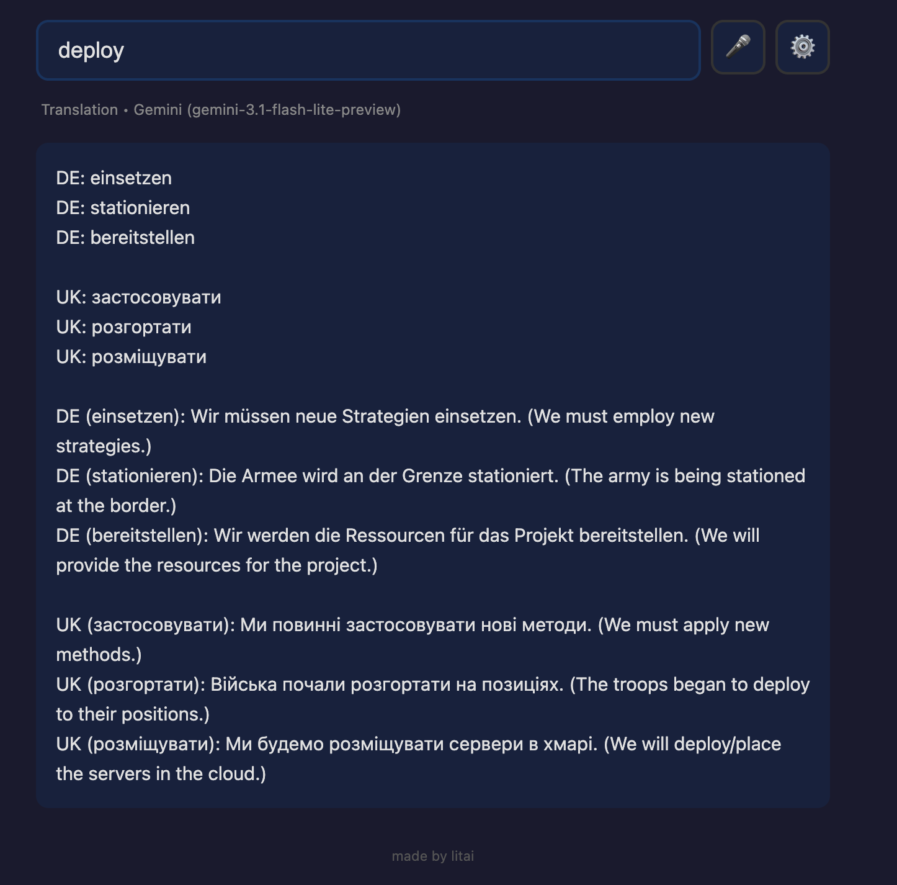
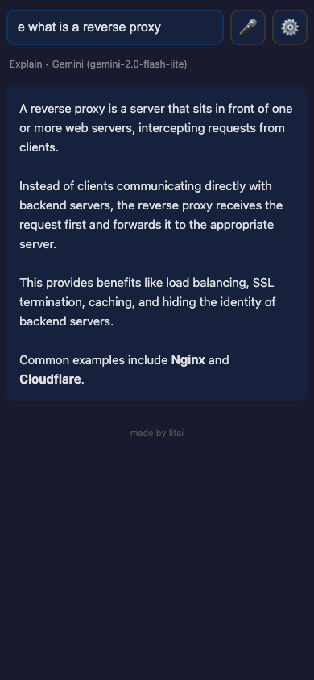

# Trivi — Your Side-Brain for Trivial Tasks

!!! abstract "Project Summary"
    **Type**: Personal Project / Open Source PWA
    **Stack**: Python (FastAPI), Vanilla JS, Gemini API
    **Source**: [github.com/litai-solutions/trivi-bot](https://github.com/litai-solutions/trivi-bot)

    **Key Features**:

    - Instant translation to multiple languages simultaneously
    - Quick explanations, bash commands, and direct answers via prefix shortcuts
    - Fully client-side API keys — no server, no accounts, no data collection
    - Custom command prefixes with user-defined prompts
    - 20KB total, installable as PWA on any device

## The Problem

You're deep in a conversation with an AI, debugging code, or reading an article. You hit an unfamiliar word. A term you half-know. A bash command you can't quite remember.

What do you do?

- Open a new browser tab, go to Google Translate, type the word, get the answer, switch back. Friction. Context switching.
- Ask your AI chat — it answers in 3 paragraphs — now you have to scroll past it to find where you were. Thread polluted.
- Or — what most of us actually do — **you skip it.** You move on. You tell yourself you'll look it up later. You won't.

Every skipped word is a small hole in your understanding. One is fine. Ten in an article? You're reading the surface.

I built Trivi because I was tired of skipping.

## How It Works

Trivi is a tiny app that lives on your phone or desktop — always one tap away. You type a word, a question, or a command prefix, hit Enter, and get an instant answer. Then you go back to what you were doing.

No chat threads. No scrolling. No context switching. No accounts.

### Translate

Just type any word or phrase. Trivi translates it to **all your languages at once.** I'm bilingual — Ukrainian and German — and when I hit a tricky English expression, I need it in both languages to really get it. Configure your target languages once in Settings, and every lookup just works.

### Explain

Type **e** + your question. Get a clear 3-6 sentence explanation. Not a lecture — just enough to understand and move on.

`e what is a reverse proxy`

### Command

Type **c** + what you need. Get the bash or Python command. Nothing else. Copy it and go.

`c find all files larger than 100mb`

## Why It Works

The magic isn't the AI. The AI is the same Gemini or ChatGPT you already use.

The magic is **friction removal.**

Opening a translator takes 5-8 seconds of context switching. That's enough for your brain to decide "not worth it." Trivi takes under 1 second — tap the app, type, Enter, done. That tiny difference changes behavior: you actually look things up instead of skipping them.

I noticed it in myself after a week: I was translating words I would have skipped before. My reading comprehension in English texts genuinely improved because I stopped ignoring gaps.

## Under the Hood

- **No accounts.** No sign-up. No data collection.
- **Your keys, your data.** API keys are stored in your browser only — never through any server.
- **Works offline** (app shell loads from cache; API calls need internet).
- **Cyrillic keyboard support.** Ukrainian `е` works as `e`, `с` as `c` — no keyboard switching needed.
- **20KB total.** The whole app is smaller than a single photo.
- **Open source.** [Source code on GitHub](https://github.com/litai-solutions/trivi-bot) — nothing hidden.

## Expandable

The four built-in modes are just the start. Open Settings and add your own command prefixes with custom prompts — summarize, grammar check, rewrite, define. Your commands, your prompts, your shortcuts.
